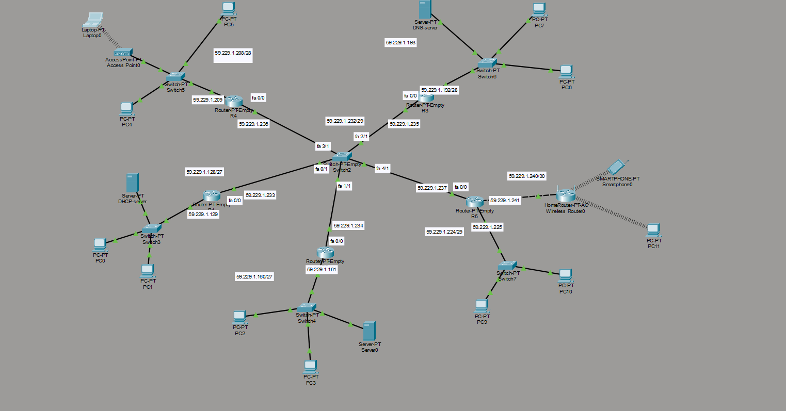

# Simulare Retea Complexa

Proiectarea si simularea in Cisco Packet Tracer a unei topologii complexe de retea, utilizând VLSM (Variable Length Subnet Masking) pentru adresarea IPv4, rutare directa și dinamica (RIPv2), precum si integrarea serviciilor de retea (DHCP, DNS) si securitate wireless cu wpa2 secure.

## Tehnologii si Concepte Implementate
* **Rutare:** Dinamica folosind RIPv2 si Static Routing
* **Servicii de Retea:** DHCP Server, DNS Server
* **Securitate:** WPA2 Wireless Security
* **Tools:** Cisco Packet Tracer, Cisco IOS CLI

## 🗺️ Topologia Retelei

